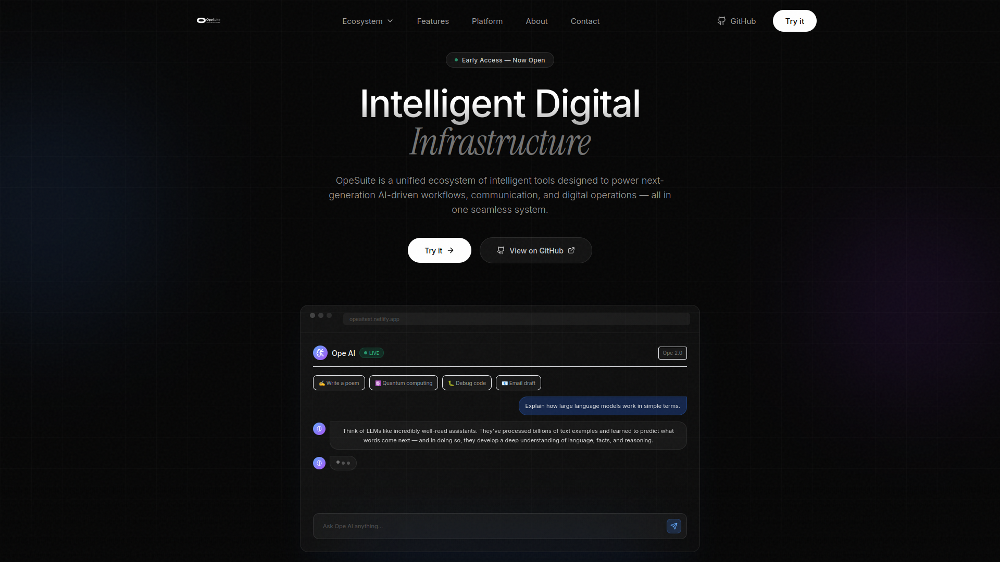
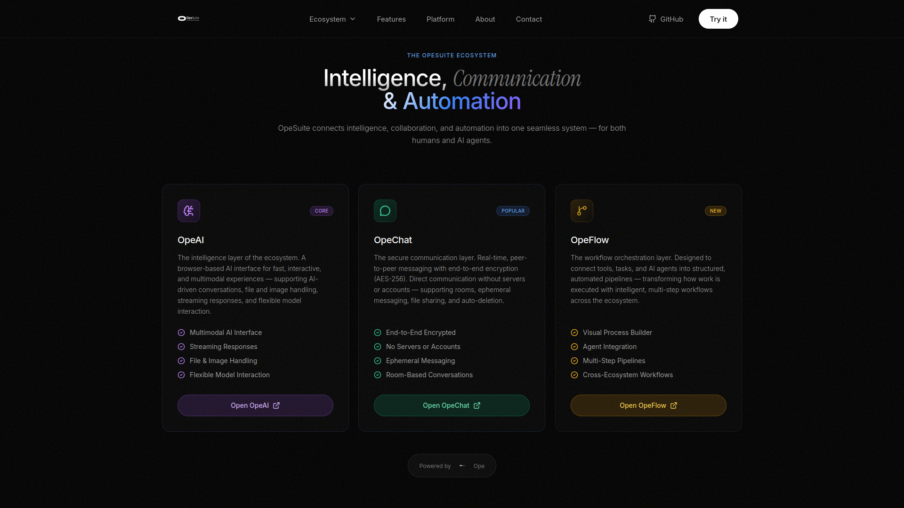
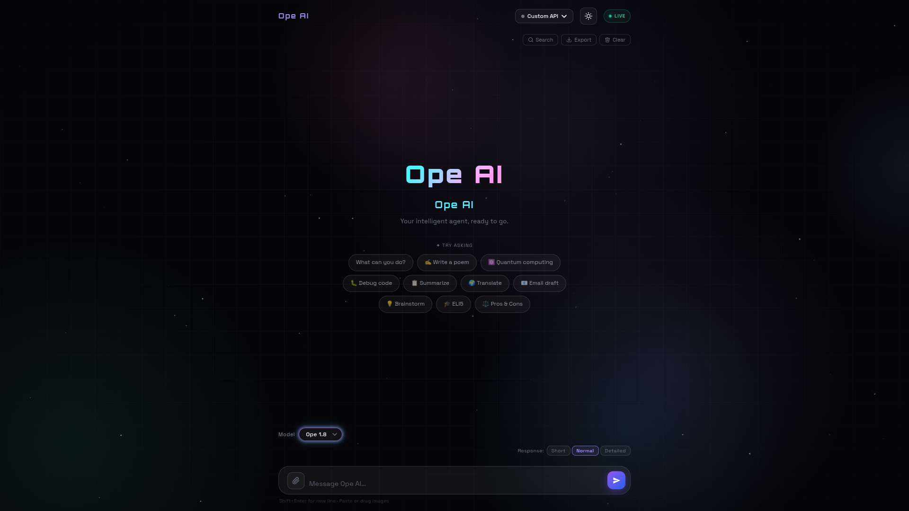
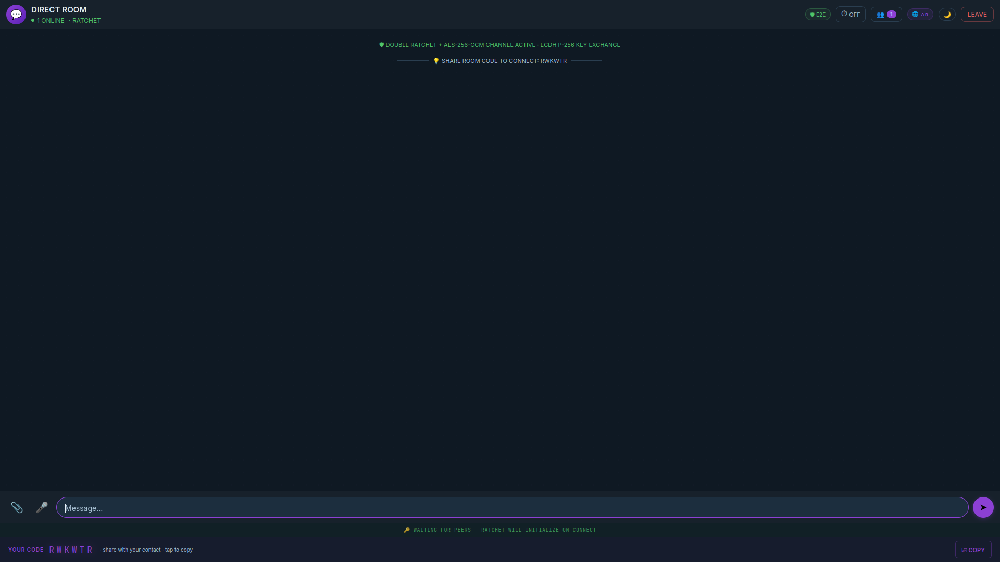
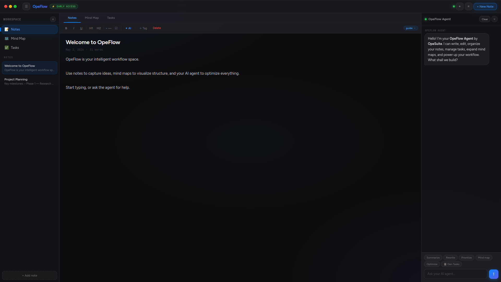
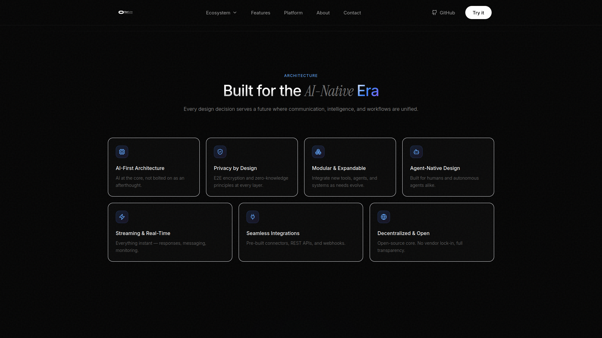
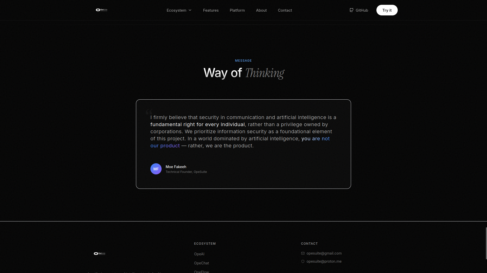

# OpeSuite

> **Secure Intelligence. Minimal Infrastructure. Total Control.**

OpeSuite is a next-generation digital platform combining AI, communication, and automation into one seamless, browser-based experience.

---

## 🌐 Live Platform

👉 [https://opesuite.github.io/opesuite/](https://opesuite.github.io/opesuite/)

---

## 🚀 Overview

OpeSuite is built around a simple idea:

> **You should be able to think, communicate, and automate — without giving up control of your data.**

No installations. No centralized systems. No unnecessary complexity.

Just powerful tools — running entirely in your browser.

---

## 🧠 Core Products

### 🤖 OpeAI

**Your intelligent interface**

A real-time AI system designed for deep thinking, fast responses, and creative workflows.

**Capabilities**

* Multi-model AI system
* Streaming responses
* Conversation memory
* Markdown rendering
* File & image input
* Custom API support
* Light / Dark mode
* Unlimited usage (v1.8 & v2.0)
* OpeCode *(coming soon)*

> Built for thinking, building, and solving.

---

### 💬 OpeChat

**Private communication, redefined**

A fully peer-to-peer messaging system with zero servers and full encryption.

**Security & Features**

* End-to-end encryption (AES-256 + Double Ratchet)
* Direct P2P communication
* No accounts, no servers
* Ephemeral messaging
* Auto message deletion
* Room-based connections
* Identity generation system
* 6-layer encryption architecture
* File sharing up to 50MB
* Runs directly from a single HTML file

> No middleman. No data collection. Just communication.

---

### 🔄 OpeFlow

**Automation without infrastructure**

OpeFlow brings logic and execution into OpeSuite — allowing you to create flows and automate processes directly in the browser.

**Capabilities**

* Visual / modular workflow system *(based on your design)*
* Event-driven logic
* Lightweight execution
* No backend dependency
* Expandable system for future integrations

> Build systems, not just actions.

---

## ⚙️ System Architecture

OpeSuite is built on three core layers:

* **OpeAI → Intelligence**
* **OpeChat → Communication**
* **OpeFlow → Automation**

Together, they form a complete, minimal, and powerful digital infrastructure.

---

## ⚡️ Key Highlights

* Fully browser-based
* No installation required
* AI-powered workflows
* Serverless communication
* Built-in automation layer
* Privacy-first architecture
* Modular and scalable

    

---

## 🌍 Socials

* Reddit: [https://www.reddit.com/user/OpeSuite/](https://www.reddit.com/user/OpeSuite/)
* X: [https://x.com/OpeSuite](https://x.com/OpeSuite)
* linkedin: [https://www.linkedin.com/in/opesuite-489166401] (https://www.linkedin.com/in/opesuite-489166401)

---

## 🚧 Status

**Early Access**

OpeSuite is actively evolving — with new modules, features, and improvements rolling out continuously.

---

## 📜 License

* 📄 Main License → `./LICENSE`
* 💬 OpeChat Terms → `./docs/OpeChat.md`
* 🤖 OpeAI Terms → `./docs/OpeAI.md`
* Flow with the same terms 
---

## 💻 Tech Stack

* Netlify
* Git / GitHub
* GIMP

---

## 💰 Support

**BTC**
`19taAMGSr2dYEbLozfSLu1g45oXA9UuFhH`

**ETH (ERC20)**
`0x52ac13687c2183f5da3412fdec2f94f44ad9188d`

---

## 🧩 Final Note

OpeSuite is not just a tool.

It’s a **system**:

* Think with AI
* Communicate privately
* Automate everything

  

All in one place.
All under your control.
