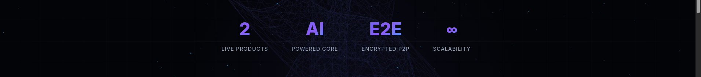
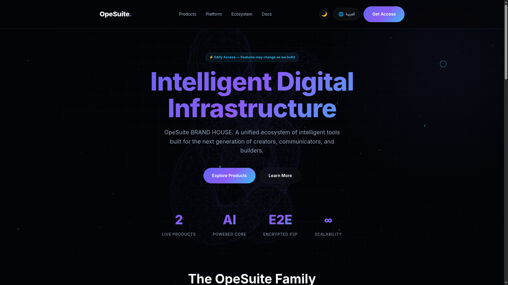
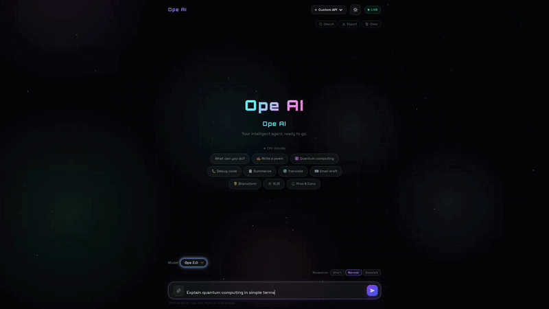
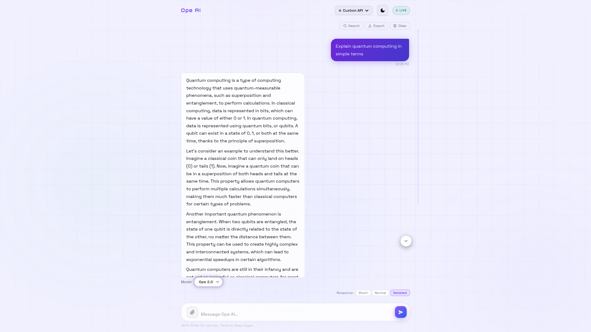
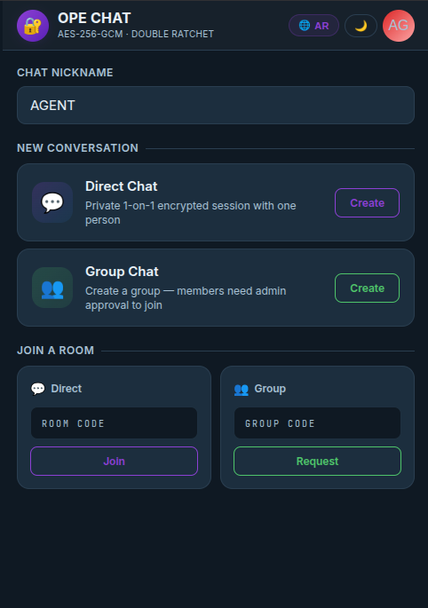
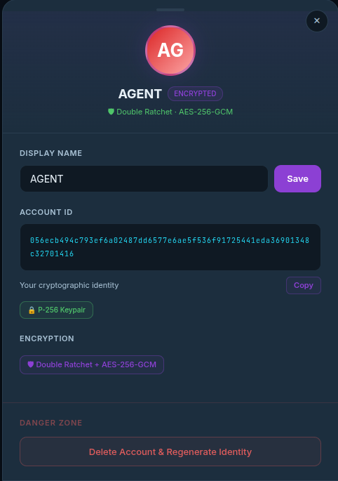
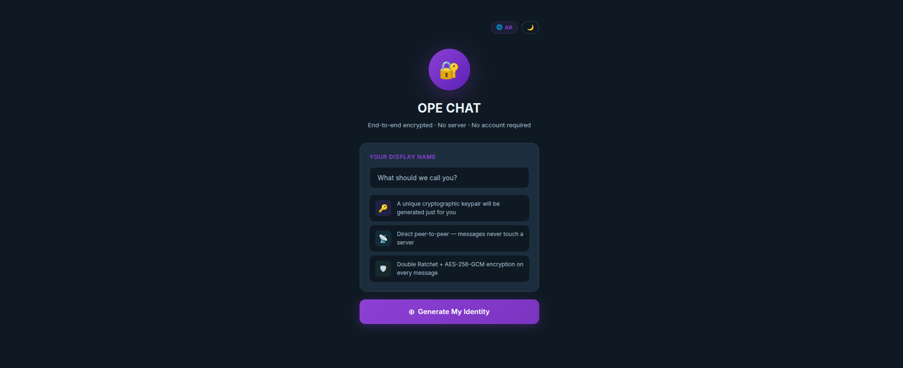
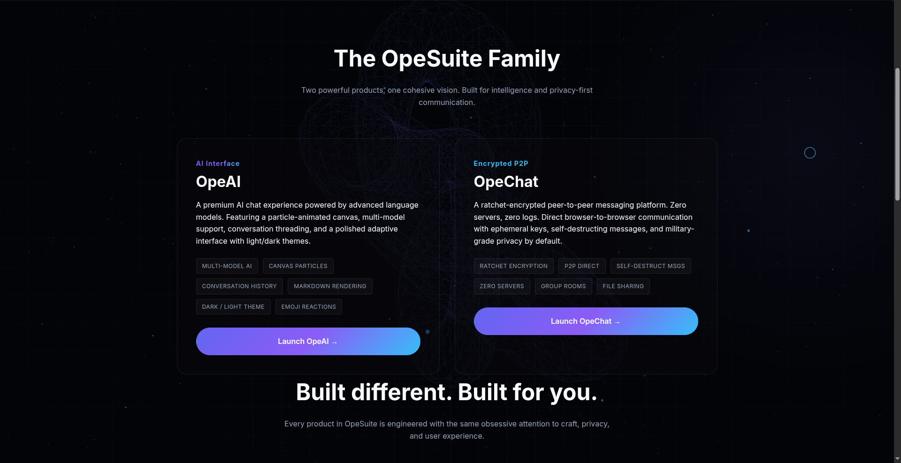

# About OpeSuite:
Ope Suite , Discover real security ,AI app & chat app built simple and secure,Your data, your control.

## 🌐 Socials:
  

# OpeSuite

> Intelligent digital infrastructure — powered by **OpeAI** and **OpeChat**

---

## 🌐 The Platform

**OpeSuite** is a unified ecosystem of intelligent tools built for:

- 🤖 AI interaction  
- 💬 Secure communication  
- ⚡ Fast, browser-based experiences  

---

## 🤖 OpeAI

 

A powerful AI interface designed for real-time interaction and deep context understanding.

### Features

- Multi-model AI system  
- Streaming responses  
- Conversation memory  
- Markdown rendering  
- File & image input  
- Custom API support  
- Light / Dark mode  

> Built for thinking, creating, and solving — directly in your browser.

---

## 💬 OpeChat

    

A secure, peer-to-peer messaging system with zero servers and full encryption.

### Features

- End-to-end encryption (AES-256 + Ratchet)  
- Direct P2P communication  
- No accounts, no servers  
- Ephemeral messaging  
- Room-based connections  
- Identity generation system  

> Private by design. No middleman.

---

## 🧠 Core Idea

OpeSuite connects:

- **AI (OpeAI)** → intelligence  
- **Chat (OpeChat)** → communication  

into one seamless system.

---

## ⚡ Highlights

- AI-powered core  
- Encrypted peer-to-peer messaging  
- Fully browser-based  
- No installation required  
- Modular and expandable  

---

## 🌍 Access

👉 https://opesuite.github.io/opesuite/

---

## 🚧 Status

Early access — features are actively evolving.

---

## 📜 License

- 📄 [Main License](./LICENSE)  
- 💬 [OpeChat Terms](./docs/OpeChat.md)  
- 🤖 [OpeAI Terms](./docs/OpeAI.md)

# 💻 Tech Stack:
   

<!-- Proudly created with GPRM ( https://gprm.itsvg.in ) -->
